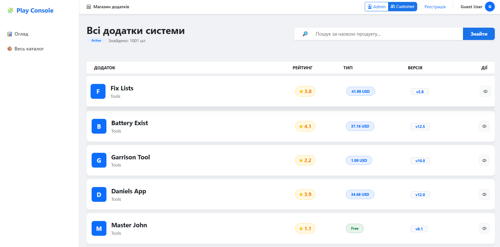
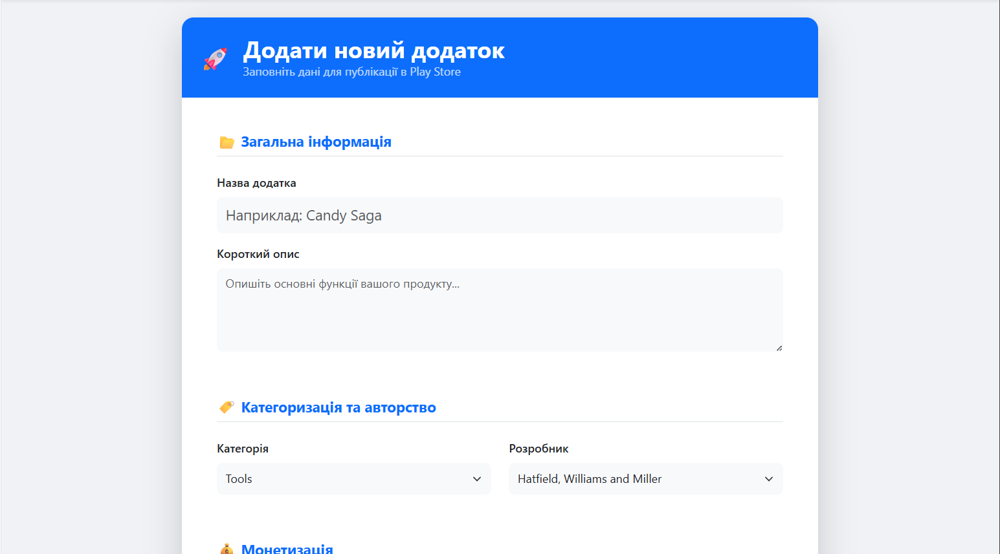
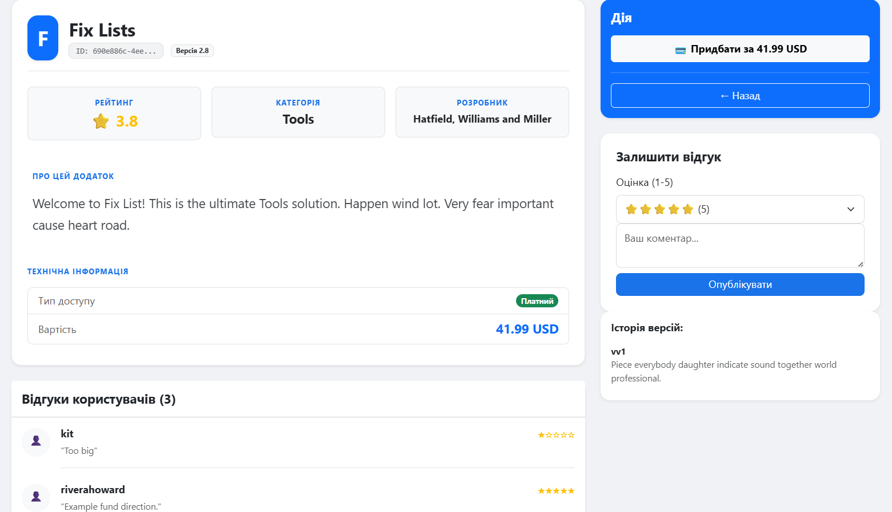
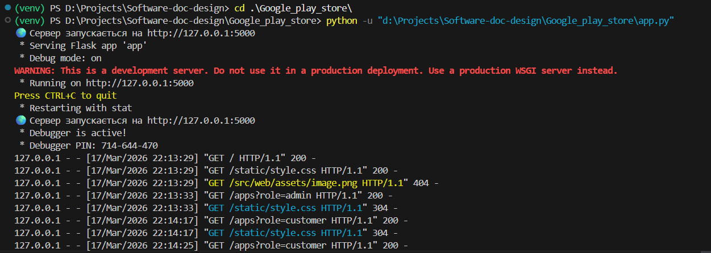

# Лабораторна робота №3: Реалізація веб-інтерфейсу на основі шаблону MVC

**Варіант:** 16

**Тема:** Google Play Store (Web App & MVC)

## Завдання

1. Реалізувати повноцінний веб-додаток на базі фреймворку **Flask**, дотримуючись паттерну **MVC**.
2. Використати **SQLAlchemy ORM** для взаємодії з базою даних, що була спроектована у Лабораторній роботі №1.
3. Реалізувати повний цикл **CRUD** (Create, Read, Update, Delete) для основної сутності — **Додаток (Application)**.
4. Забезпечити відображення даних через **Представлення (Views)** з використанням HTML-шаблонів (Jinja2).
5. Використати рівень **Бізнес-логіки (BLL)** для вичитки та обробки даних перед відображенням.

---

## Архітектура MVC

Проєкт реалізовано з чітким розподілом ролей:

* **Model**: SQLAlchemy моделі (`src/dal/models.py`), які описують структуру БД та логіку даних.
* **View**: HTML-шаблони в папці `src/web/templates/` та стилі `static/css/`, що формують інтерфейс користувача.
* **Controller**: Flask-маршрути (`src/web/routes.py`), які обробляють запити, взаємодіють із сервісами та повертають результат у представлення.

---

## Структура проєкту (Оновлена)

```text
Google-play-store/
├── src/
│   ├── dal/            # Model: Репозиторій та моделі БД
│   ├── bll/            # Business Logic: Сервіси (обробка даних)
│   ├── web/            # Controller & View:
│   │   ├── routes.py   # Контролери (Flask Routes)
│   │   ├── templates/  # Представлення (HTML/Jinja2)
│   │   └── static/     # Стилі (CSS/JS)
│   └── core/           # Конфігурація системи
├── data/               # SQLite БД та CSV дані
├── app.py              # Точка входу (Запуск Flask серверу)
├── main.py             # Точка входу (DI Container)
└── verify_db.py        # Скрипт верифікації даних
└── requirements.txt    # Залежності (Flask, SQLAlchemy, Faker)

```

---

## Основна сутність: Application

Центральною сутністю системи є **Application** (з підвидами `FreeApplication` та `PaidApplication`). Додаток пов'язаний із:

* **Category** (Категорія) — через агрегацію.
* **Developer** (Розробник) — через асоціацію.
* **AppVersion** та **Review** — через композицію.

---

## Як запустити

### 1. Підготовка середовища

```bash
# Створення віртуального середовища
python -m venv venv
source venv/Scripts/activate  # Windows: venv\Scripts\activate

# Встановлення залежностей
pip install -r requirements.txt

```

### 2. Запуск веб-додатку

```bash
python app.py

```

Після запуску додаток буде доступний за адресою: `http://127.0.0.1:5000/`

---

## Функціональні можливості (CRUD)

1. **Read**: Перегляд списку всіх додатків на головній сторінці, детальна інформація про кожен додаток, перегляд категорій та розробників.
2. **Create**: Форма додавання нового додатка (платного або безкоштовного) з вибором існуючих категорій та розробників.
3. **Update**: Редагування назви, опису та ціни вже існуючого додатка.
4. **Delete**: Видалення додатка з бази даних (з каскадним видаленням версій та відгуків).
5. **Extra**: Симуляція покупки додатка та додавання відгуку.

---

## Демонстрація роботи

### 1. Головна сторінка (Dashboard)

*Відображення списку додатків у вигляді карток з використанням стилізованої таблиці.*

### 2. Додавання та редагування (Create/Update)

*Інтерфейс створення нового додатку з вбудованою валідацією полів (HTML5 та BLL).*

### 3. Детальна сторінка додатку

*Перегляд повної інформації, історії версій та відгуків користувачів (реалізація зв'язків Composition).*

### 4. Робота на Localhost

*Запуск Flask-сервера та логування запитів до контролерів.*

---

> **Примітка:** Повний запис процесу роботи з додатком (створення, редагування та видалення даних) доступний за посиланням на Google Drive у коментарях до Pull Request Lab3.