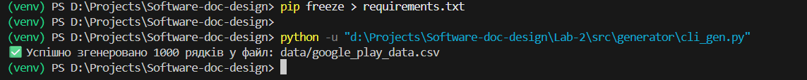
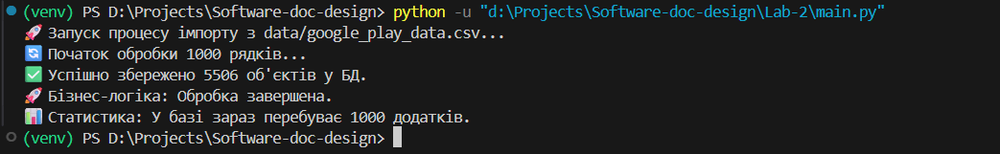
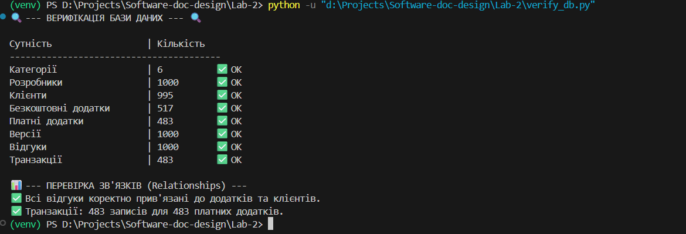
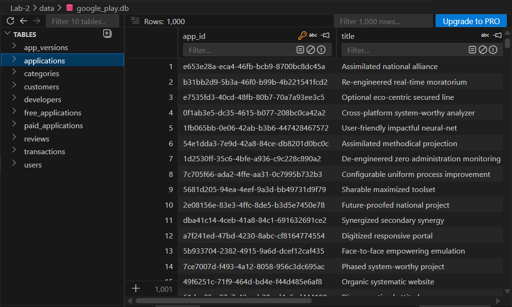

# Лабораторна робота №2: Реалізація серверної частини аплікації

**Варіант:** 16
**Тема:** Google Play Store (Backend & ORM)

## Завдання

1. Реалізувати серверну частину застосунку з використанням **трирівневої архітектури** (DAL, BLL, PL).
2. Забезпечити зв'язок між рівнями через **інтерфейси** та шаблони **Inversion of Control (IoC)** / **Dependency Injection (DI)**.
3. Використати **SQLAlchemy ORM** для мапінгу об'єктів у базу даних SQLite згідно з діаграмою класів із Лаби №1.б.
4. Створити **CLI-генератор** для створення масиву даних (мінімум 1000 рядків) у форматі CSV.
5. Реалізувати бізнес-логіку імпорту даних із CSV-файлу в реляційну базу даних з дотриманням цілісності зв'язків.

---

## Архітектура системи

Проєкт побудований на принципах чистої архітектури, де кожен шар має чітку зону відповідальності:

* **DAL (Data Access Layer)**: Відповідає за взаємодію з SQLite та читання CSV. Використовує паттерн **Repository**.
* **BLL (Business Logic Layer)**: Містить сервіси для обробки даних, створення моделей та управління транзакціями.
* **PL (Presentation Layer)**: Представлений інтерфейсами, які описують майбутній UI (CLI/Mobile).
* **Core**: Містить централізовану конфігурацію проєкту.

---

## Структура проєкту

```text
Lab-2/
├── src/
│   ├── dal/            # Моделі SQLAlchemy та Repository
│   ├── bll/            # Бізнес-логіка та сервіси
│   ├── pl/             # Інтерфейси презентаційного рівня
│   ├── core/           # Конфігурація (Config)
│   └── generator/      # CLI інструмент для генерації даних
├── data/               # CSV файли та SQLite БД
├── main.py             # Точка входу (DI Container)
└── verify_db.py        # Скрипт верифікації даних

```

---

## Реалізація моделей

Моделі в коді повністю відповідають діаграмі класів. Реалізовано:

* **Успадкування**: `Joined Table Inheritance` для типів додатків та користувачів.
* **Поліморфізм**: Перевизначення методу `download_app()` для різних типів контенту.
* **Зв'язки**: `One-to-Many` (Category -> Apps), `Many-to-One` (App -> Developer), та `Composition` (App -> Versions/Reviews).

---

## Як запустити

### 1. Підготовка середовища

```bash
# Створення віртуального середовища
python -m venv venv
source venv/Scripts/activate  # для Windows

# Встановлення залежностей
pip install -r requirements.txt

```

### 2. Генерація даних (1000+ рядків)

```bash
python src/generator/cli_gen.py --count 1050

```

### 3. Запуск імпорту та бізнес-логіки

```bash
python main.py

```

### 4. Верифікація бази даних

```bash
python verify_db.py

```

---

## Демонстрація роботи 

### 1. Робота CLI Генератора

*Процес створення CSV файлу з випадковими даними.*

### 2. Виконання імпорту (Main)

*Лог роботи BLL: створення категорій, розробників та додатків.*

### 3. Верифікація БД та зв'язків

*Результат перевірки кількості записів та цілісності Foreign Keys.*

### 4. Перегляд БД (SQLite Viewer)

*Відображення таблиць та даних безпосередньо в базі.*

