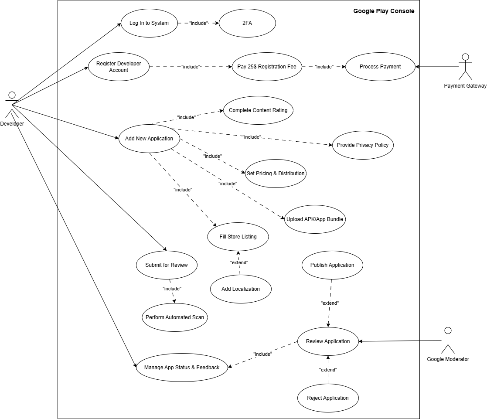
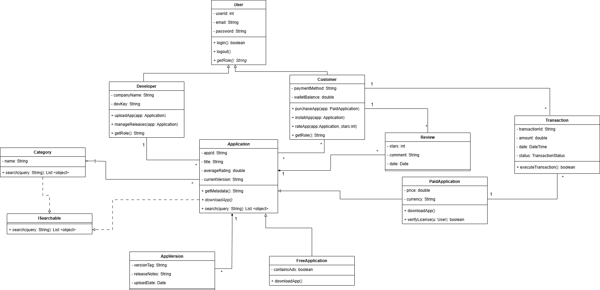
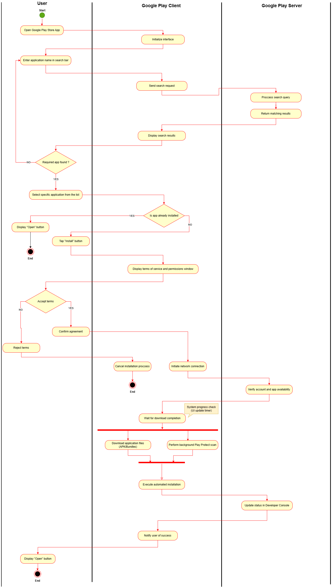
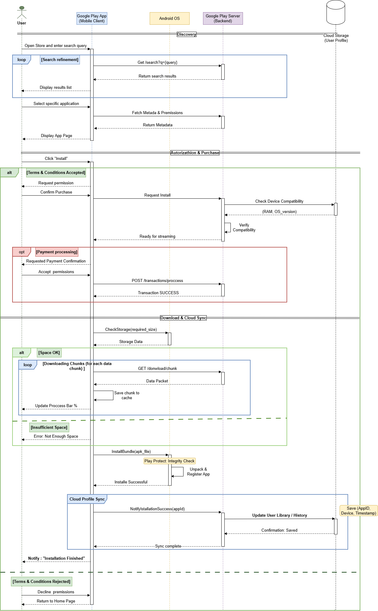

# Лабораторна робота №1: Діаграми архітектури ПЗ

**Варіант:** 16
**Тема:** Google Play Store

## Завдання
1. Намалюйте use-case діаграму додавання нового додатку на Google Play Store .
2. Намалюйте діаграму класів, щоб представити множину об’єктів, які задіяні в роботі Google Play Store .
3. Намалюйте діаграму активності пошуку та скачування додатку з Google Play Store користувачем (врахуйте необхідність приняття або відхилення умов користування).
4. Намалюйте sequence діаграму, яка показує процес скачування та встановлення додатку на мобільному телефоні, та збереження інформації про скачувані додатки на хмарному сховищі користувача (в профілі користувача).

---

## Діаграми

### 1. Use-Case Діаграма

*Відображає процеси реєстрації розробника, завантаження контенту та проходження модерації. Враховано автоматичне сканування системи безпеки.*

### 2. Діаграма класів

*Реалізовано ієрархію додатків (платні/безкоштовні) з використанням **поліморфізму** та **успадкування**. Використано інтерфейс `ISearchable` для гнучкості пошуку.*

### 3. Діаграма активності

*Показує шлях користувача від пошуку до інсталяції. Використано **swimlanes** для розділення зон відповідальності (User, Client, Server).*

### 4. Sequence Діаграма

*Деталізує взаємодію між мобільним додатком, сервером Google та Android OS. Відображено процес збереження даних у **Cloud Profile**.*