# Лабораторна робота №4: Реалізація GoF-паттерну "Стратегія"

**Варіант:** 16 (NYPD Shooting Incident Data)

**Тема:** NYPD Incident Analysis & Multi-channel Data Export (Strategy Pattern)

## Завдання

1. Вичитати дані з отриманого згідно з варіантом датасету (**NYPD Shooting Incident**).
2. Реалізувати паттерн **Strategy** для виводу отриманих даних у різні сховища (консоль, файл, Kafka, Redis).
3. Відокремити код вичитки даних (DAL) від коду обробки та виводу (BLL).
4. Забезпечити можливість перемикання стратегій виводу без зміни програмного коду (через конфігураційні файли або динамічно в Runtime).
5. Налаштувати інфраструктуру (Kafka, Redis) за допомогою **Docker Compose**.

---

## Архітектура: Pattern Strategy

Проєкт побудований на принципах чистої архітектури та паттерні **Strategy**:

* **Strategy Interface**: `ExportStrategy` — абстрактний клас, що визначає загальний інтерфейс для всіх типів виводу.
* **Concrete Strategies**: `ConsoleStrategy`, `FileOutputStrategy`, `KafkaStrategy`, `RedisStrategy` — конкретні реалізації логіки експорту.
* **Context**: `NYPDExporter` — клас, який використовує обрану стратегію для виконання операції, залишаючись незалежним від деталей реалізації.
* **Factory**: `ExporterFactory` — створює об'єкти стратегій на основі конфігураційного файлу `config.json`.


---

## Структура проєкту

```text
NYPD_analysis/
├── src/
│   ├── dal/                # Data Access Layer
│   │   └── reader.py       # Вичитка CSV (NYPD Shooting Incidents)
│   ├── bll/                # Business Logic Layer
│   │   ├── strategies.py   # Реалізація паттерну Strategy (Console, File, Kafka, Redis)
│   │   └── exporter.py     # Context (Використання стратегій)
│   └── core/
│       └── factory.py      # Фабрика для створення стратегій з конфігу
├── data/                   # Вхідні CSV дані та вихідні JSON файли
├── docker-compose.yml      # Конфігурація інфраструктури (Kafka, Redis, Zookeeper)
├── config.json             # Зовнішня конфігурація системи
├── main.py                 # Точка входу (Інтерактивне меню та логіка запуску)
└── requirements.txt        # Залежності (redis, kafka-python)
```

---

## Конфігурація (config.json)

Програма підтримує зміну параметрів без перекомпіляції:

```json
{
    "data_path": "data/nypd_data.csv",
    "export_mode": "file",
    "kafka_settings": {
        "bootstrap_servers": "localhost:9092",
        "topic": "nypd_incidents"
    },
    "file_settings": {
        "output_file": "data/export_nypd.json"
    }
}
```

---

## Як запустити

### 1. Підготовка інфраструктури (Docker)
Для роботи з Kafka та Redis необхідно підняти контейнери:
```bash
docker-compose up -d
```

### 2. Встановлення залежностей
```bash
pip install -r requirements.txt
```

### 3. Запуск аналізатора
```bash
python main.py
```

---

## Функціональні можливості

1.  **Динамічне перемикання**: Можливість обрати стратегію через інтерактивне консольне меню під час виконання.
2.  **Graceful Degradation (MOCK)**: Якщо Docker-сервіси недоступні, система автоматично переходить у режим імітації (Mock), логуючи проблему та не перериваючи роботу.
3.  **JSON Serialization**: Всі дані перед відправкою в Kafka/Redis або записом у файл проходять процес валідації та серіалізації.
4.  **Ефективність (Batching)**: Для Kafka реалізована пакетна відправка повідомлень (`flush` після циклу) для оптимізації мережевого навантаження.

-----

## Демонстрація роботи

Для перевірки працездатності паттерну **Strategy** та інтеграції з Docker-інфраструктурою було протестовано всі сценарії виводу даних.

### 1. Експорт у консоль (Console Strategy)
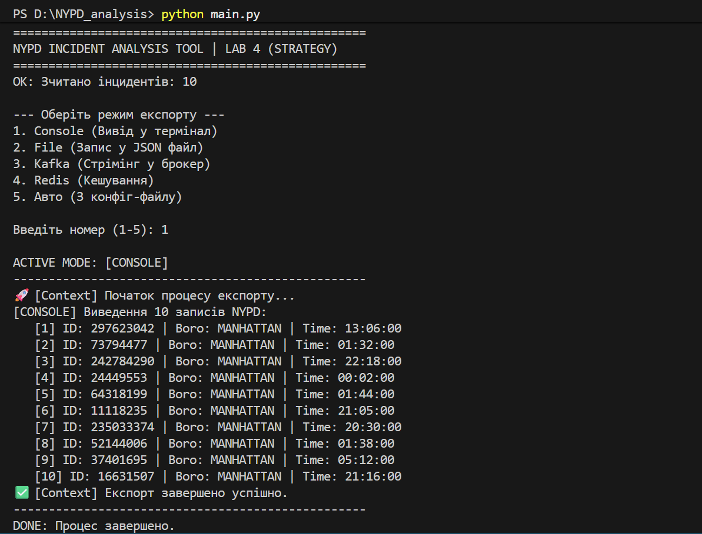
Відображення даних NYPD у терміналі з імітацією реального часу.
*Вивід ID інцидентів, районів та часу подій безпосередньо в CLI.*

### 2. Експорт у файл (File Strategy)
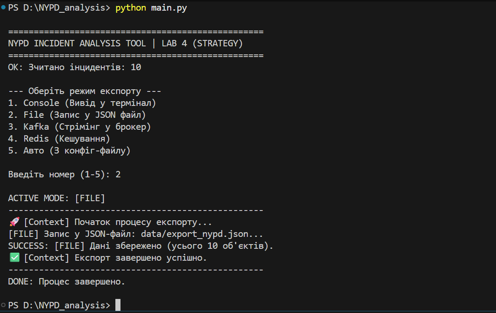
Серіалізація об'єктів у формат JSON та збереження в локальну папку.
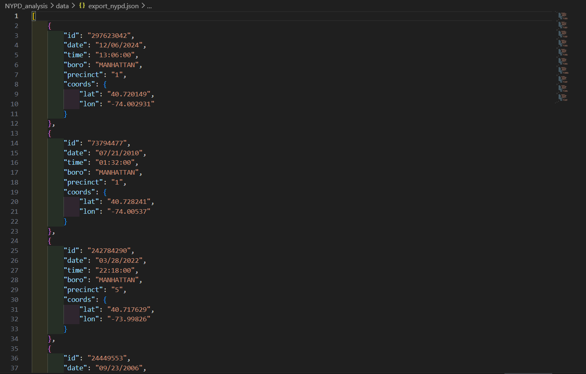
*Створений файл `data/export_nypd.json` з відформатованими даними.*

### 3\. Експорт у Kafka (Broker Strategy)
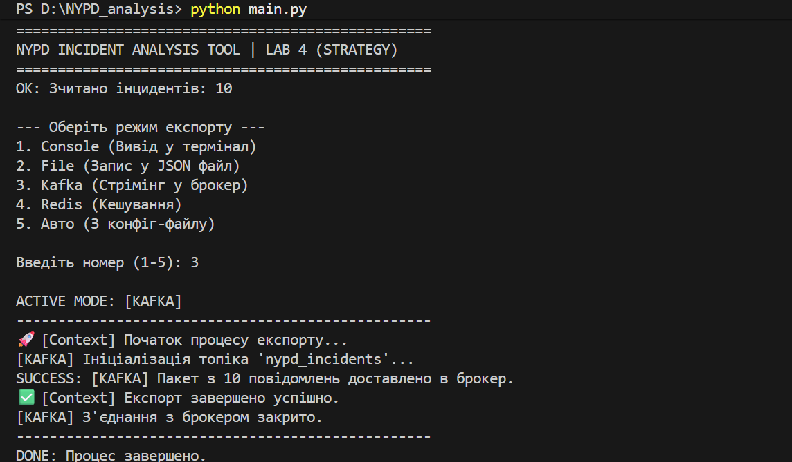
Стрімінг повідомлень у топік Kafka в межах Docker-мережі.
*Процес відправки пакетів даних у брокер повідомлень.*

### 4\. Експорт у Redis (Cache Strategy)
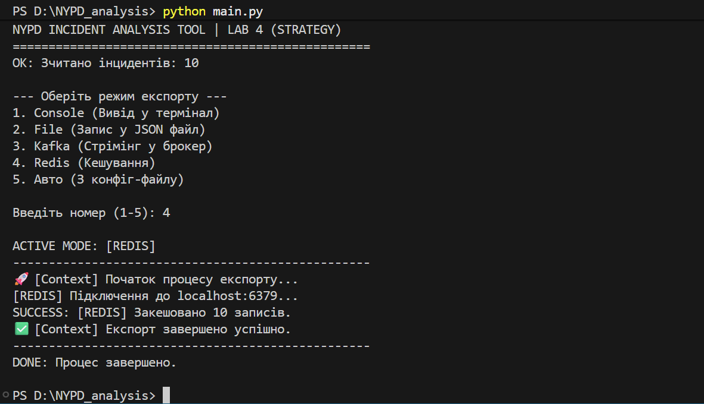
Збереження інцидентів у Key-Value сховище Redis для швидкого доступу.
*Успішне кешування записів у базу даних Redis.*

### 5\. Обробка помилок (Error Handling)
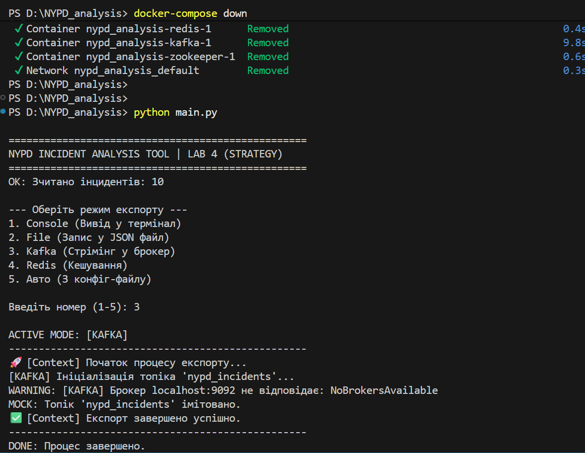
Демонстрація відмовостійкості системи (Graceful Degradation).
*Логування спроби підключення та автоматичний перехід у режим імітації (MOCK) при відсутності Docker-контейнерів.*

-----

## Інфраструктура та робота з Docker

Усі зовнішні сервіси (Kafka, Zookeeper, Redis) розгорнуті за допомогою **Docker Compose**.

### 1\. Керування контейнерами та статус
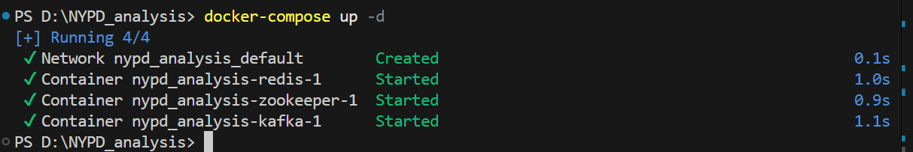
Запуск інфраструктури та перевірка активності всіх сервісів.
*Результат виконання команд `docker-compose up -d` та `docker ps`.*

### 2\. Верифікація даних у Redis
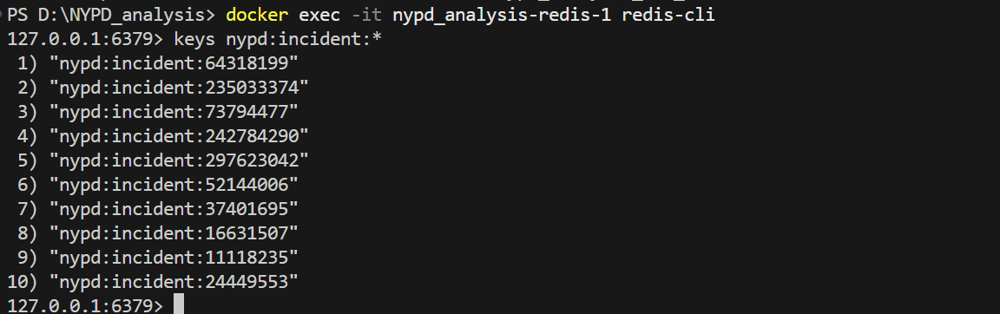
Перевірка вмісту бази даних безпосередньо через Redis CLI всередині контейнера.
*Відображення списку ключів `keys nypd:incident:*` та вмісту конкретного запису.*

### 3\. Верифікація даних у Kafka
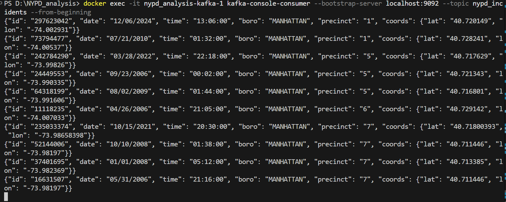
Моніторинг повідомлень, що надходять у брокер, у реальному часі.
*Робота `kafka-console-consumer`, що відображає JSON-об'єкти, отримані з топіка.*

## Додаткове завдання на захист (Cloud Integration)

Для демонстрації гнучкості паттерну **Strategy** систему було розширено підтримкою хмарної бази даних **Google Firebase Realtime Database**. Це дозволяє синхронізувати дані інцидентів у реальному часі між локальним додатком та хмарою.

### 6. Експорт у Firebase (Cloud Strategy)
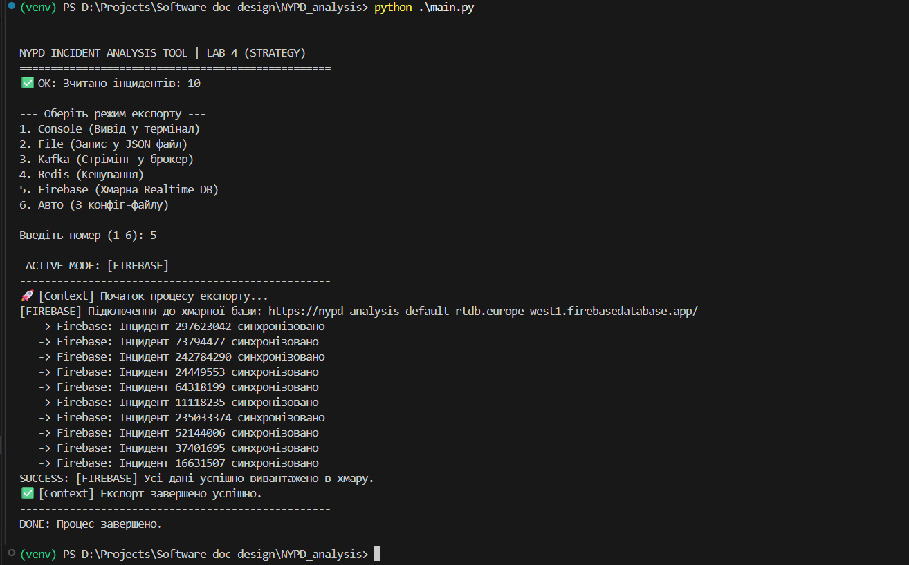
Процес відправки даних на REST API Firebase. Кожен запис автоматично стає частиною JSON-дерева в хмарі.
*Логування успішної синхронізації кожного окремого інциденту.*

### 7. Верифікація даних у Firebase Console
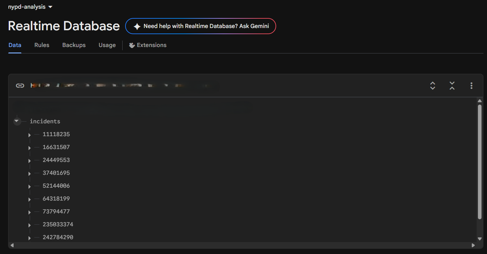
Перевірка отриманих даних через веб-консоль Firebase.
*Дані відображаються у структурованому вигляді `incidents -> {id}` та доступні для миттєвого читання іншими сервісами.*

